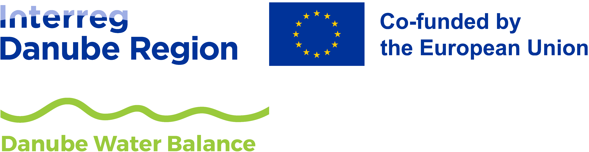
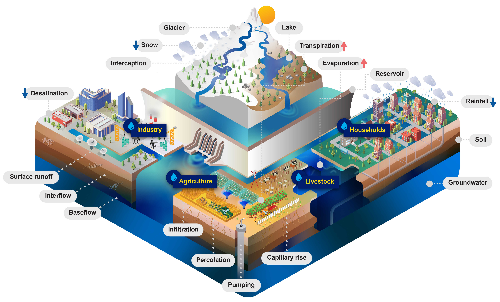

# CWatM_DWB_tools

User manual and model documentation of CWatM at [https://cwatm.iiasa.ac.at](https://cwatm.iiasa.ac.at).

## Danube Water Balance project

Intereg Danube project
DRP0200156
Danube Water Balance
Development of a harmonized water balance
modelling system for the Danube River Basin
[https://interreg-danube.eu/projects/danube-water-balance](https://interreg-danube.eu/projects/danube-water-balance)

  

The Danube River Basin (DRB) is one of the most diverse transboundary river basins of the World in the sense that 14
countries share over its territory with different cultural, societal and economic backgrounds.
Therefore, it was essential to establish a broad partnership for the implementation of this project. All
the 14 DRB countries are represented in the project with the involvement of 20 PPs from 11 countries
(6 from 3 non-EU ones) and 13 ASPs. It is the first time that all Danube countries would work jointly
to achieve a better understanding and a common interpretation of the water balance in order to lay
the foundations of improved water management.

The overall objective of the project is to develop a harmonized water balance modelling system in
the DRB. Our main outputs will cover four fields with the hydrological model CWatM being one of them:

The state-of-the-art, open-source water balance model for the DRB, that allows the quantification
of water balance components for the entire basin and for selected areas of interest. The model will
be calibrated and validated against measured data collected and processed by jointly defined data
management protocols, assuring the common acceptance of model results. The foreseen afterlife of
the water balance model is a fully functional water management model of the basin, by which a more
reasonable, sustainable and adaptive water management can be achieved in the long run.

## Overview of CWatM

Community Water Model (CWatM) is a hydrological model simulating the water cycle daily at global and local levels, historically and into the future, maintained by IIASA’s Water Security group. CWatM assesses water supply, demand, and environmental needs, including water management and human influence within the water cycle. CWatM includes an accounting of how future water demands will evolve in response to socioeconomic change and how water availability will change in response to climate and management.

CWatM is open source, and its modular structure facilitates integration with other models. CWatM will be a basis to develop next-generation global hydro-economic modelling coupled with existing IIASA models like MESSAGE and GLOBIOM.

  

##Pre- and post processing tools to run and evaluate the hydrological model CWatM in the DWB project

The repository is split into preprocessing - all scripts used for changing data to make a CWatM compatible dataset, calibration tool, river network tools, etc

and postprocessing tools,
generating figures, timeseries from netcdf, evaluation of the model , etc