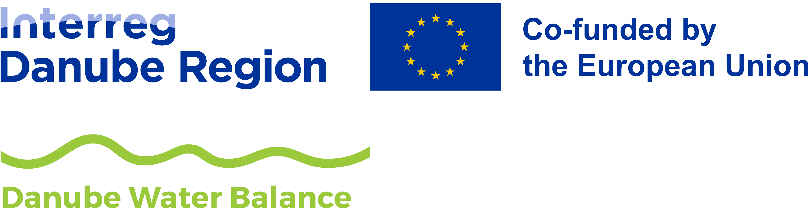

# CWatM_DWB_tools

[](https://github.com/iiasa/CWatM_DWB_tools)
[](https://github.com/iiasa/CWatM_DWB_tools/blob/version1.05/LICENSE)
[](https://github.com/iiasa/CWatM_DWB_tools)

User manual and model documentation of CWatM at [https://cwatm.iiasa.ac.at](https://cwatm.iiasa.ac.at).


## Danube Water Balance project

Intereg Danube project
DRP0200156
Danube Water Balance
Development of a harmonized water balance
modelling system for the Danube River Basin
[https://interreg-danube.eu/projects/danube-water-balance](https://interreg-danube.eu/projects/danube-water-balance)

<p align="center">
  
</p>

The Danube River Basin (DRB) is one of the most diverse transboundary river basins of the World in the sense that 14
countries share over its territory with different cultural, societal and economic backgrounds.
Therefore, it was essential to establish a broad partnership for the implementation of this project. All
the 14 DRB countries are represented in the project with the involvement of 20 PPs from 11 countries
(6 from 3 non-EU ones) and 13 ASPs. It is the first time that all Danube countries would work jointly
to achieve a better understanding and a common interpretation of the water balance in order to lay
the foundations of improved water management.

The overall objective of the project is to develop a harmonized water balance modelling system in
the DRB. Our main outputs will cover four fields with the hydrological model CWatM being one of them:

The state-of-the-art, open-source water balance model for the DRB, that allows the quantification
of water balance components for the entire basin and for selected areas of interest. The model will
be calibrated and validated against measured data collected and processed by jointly defined data
management protocols, assuring the common acceptance of model results. The foreseen afterlife of
the water balance model is a fully functional water management model of the basin, by which a more
reasonable, sustainable and adaptive water management can be achieved in the long run.

## Overview of CWatM

Community Water Model (CWatM) is a hydrological model simulating the water cycle daily at global and local levels, historically and into the future, maintained by IIASA’s Water Security group. CWatM assesses water supply, demand, and environmental needs, including water management and human influence within the water cycle. CWatM includes an accounting of how future water demands will evolve in response to socioeconomic change and how water availability will change in response to climate and management.

CWatM is open source, and its modular structure facilitates integration with other models. CWatM will be a basis to develop next-generation global hydro-economic modelling coupled with existing IIASA models like MESSAGE and GLOBIOM.

<p align="center">
  
</p>

##Pre- and post processing tools to run and evaluate the hydrological model CWatM in the DWB project

The repository is split into preprocessing - all scripts used for changing data to make a CWatM compatible dataset, calibration tool, river network tools, etc. and postprocessing tools, generating figures, timeseries from netcdf, evaluation of the model , etc.

## Preprocessing tools

All preprocessing tools are located under the `preprocessing/` directory of the repository:

```text
CWatM_DWB_tools/
└── preprocessing/
    ├── Compare at stations with NetCDF/      # Tool 1: Model simulations against observations
    ├── clip_netcdf/                          # Tool 2: Spatial clipping tool
    ├── Tool_to_correct_Morava/               # Tool 3: River routing correction
    ├── thermalindex/                         # Tool 4: Thornthwaite Thermal Index calculator
    ├── Meteo_projection_analysis/            # Tool 5: Meteorological data analysis
    ├── Time_series_format_gap_correction/    # Tool 6: Data cleaning & gap analysis
    └── tif_to_NetCDF/                        # Tool 7: GeoTIFF to NetCDF converter
```

---

## Overview of preprocessing tools and their locations

### 1. Compare Stations with NetCDF
* **Description:** A Python Jupyter Notebook designed to compare observations and any number of simulation outputs.
* **Where to find it:** `preprocessing/Compare at stations with NetCDF/`
* **GitHub Link:** [Compare at stations with NetCDF](https://github.com/iiasa/CWatM_DWB_tools/tree/master/preprocessing/Compare%20at%20stations%20with%20NetCDF)

### 2. Clip NetCDF
* **Description:** A Python program developed to clip large-scale global or regional NetCDF datasets down to a specific sub-basin or regional modeling domain.
* **Where to find it:** `preprocessing/clip_netcdf/`
* **GitHub Link:** [clip_netcdf](https://github.com/iiasa/CWatM_DWB_tools/tree/master/preprocessing/clip_netcdf)

### 3. River Network Correction
* **Description:** An ArcGIS Toolbox developed to manually river routing correction.
* **Where to find it:** `preprocessing/Tool_to_correct_Morava/`
* **GitHub Link:** [Tool_to_correct_Morava](https://github.com/iiasa/CWatM_DWB_tools/tree/master/preprocessing/Tool_to_correct_Morava)

### 4. Thermal Index for ET Calculation with Thornthwaite Method
* **Description:** A Python-based script designed to estimate potential evaporation (PET) with Thornthwaite Method.
* **Where to find it:** `preprocessing/thermalindex/`
* **GitHub Link:** [thermalindex](https://github.com/iiasa/CWatM_DWB_tools/tree/master/preprocessing/thermalindex)

### 5. Meteorological Data Analysis
* **Description:** An R-based Jupyter Notebook developed to analyze and compare meteorological datasets.
* **Where to find it:** `preprocessing/Meteo_projection_analysis/`
* **GitHub Link:** [Meteo_projection_analysis](https://github.com/iiasa/CWatM_DWB_tools/tree/master/preprocessing/Meteo_projection_analysis)

### 6. Time Series Data Format Correction and Data Gap Analysis
* **Description:** A tool (mainly R scripts) designed to automate the cleaning, formatting, and gap assessment of highly heterogeneous station-level time series data files. The tool consists of dedicated scripts that perform the following operations:
  * **Insert nodata records:** Automatically fills missing dates with placeholders while maintaining station order.
  * **Remove unwanted columns:** Removes specified columns by their indices.
  * **Change date format:** Corrects date formatting anomalies into the desired format.
  * **Add prefix to station codes:** Adds specified prefixes to the beginning of every line.
  * **Calculation number of data:** Computes valid data counts per station and year, saving them as a text report.
  * **Change exponential values to normal:** Converts scientific/exponential notation into standard number formats.
  * **Round data values:** Rounds values to desired decimal places while skipping missing records.
  * **Remove records outside date ranges:** Filters out dates that do not fall within user-defined boundaries.
  * **Check for duplicates:** Pinpoints duplicate records (same station ID and date) without modifying data.
  * **Transform long format to matrix:** Transposes long-format timeseries into a wide matrix layout.
  * **VBA Consolidate Sheets:** A VBA macro that merges all processed worksheets and pivot tables into a single "MasterSheet" to easily summarize temporal data coverage and gaps.
* **Where to find it:** `preprocessing/Time_series_format_gap_correction/`
* **GitHub Link:** [Time_series_format_gap_correction](https://github.com/iiasa/CWatM_DWB_tools/tree/master/preprocessing/Time_series_format_gap_correction)
### 7. Tif to NetCDF
* **Description:** A Python script which converts standard GeoTIFF spatial raster layers into NetCDF format.
* **Where to find it:** `preprocessing/tif_to_NetCDF/`
* **GitHub Link:** [tif_to_NetCDF](https://github.com/iiasa/CWatM_DWB_tools/tree/master/preprocessing/tif_to_NetCDF)
